<h2 align="center">Stock Market Predictor</h2>

[](https://github.com/psf/black)
[](https://opensource.org/licenses/MIT)

---

> **⚠️ Financial Disclaimer**
>
> This project is for educational and research purposes only. It does **not** constitute financial advice, investment advice, or a recommendation to buy or sell any securities. Use of this software is at your own risk. Always consult a qualified financial advisor before making investment decisions. The author and contributors are not responsible for any financial losses or damages resulting from the use of this code.

----

<summary>Table of Contents</summary>
<ol>
<li><a href="#description">Description</a></li>
<li><a href="#features">Features</a></li>
<li><a href="#installation">Installation</a></li>
<li><a href="#directory-structure">Directory Structure</a></li>
<li><a href="#model-overview">Model Overview</a></li>
<li><a href="#usage">Usage</a>
  <ul>
    <li><a href="#trainpy">Train</a></li>
    <li><a href="#testpy">Test</a></li>
    <li><a href="#predictpy">Predict</a></li>
    <li><a href="#run_allpy">Run All</a></li>
    <li><a href="#scheduler-and-batch-training">Scheduler & Batch Training</a></li>
  </ul>
</li>
<li><a href="#project-flow">Project Flow</a></li>
<li><a href="#how-to-add-features">How to Add Features</a></li>
<li><a href="#license">License</a></li>
</ol>

## Description
Stock_Prediction is a modular, extensible machine learning framework for stock market prediction. Designed for flexibility and experimentation, it allows for easy switching between model types (Linear Regression, LSTM, Transformer, etc.), and makes it simple to add new technical indicators or derived features. All model parameters and configurations are stored in single-file pickles for reproducibility.

- **Author:** Max Schwickert
- **Capstone project (high school)**
- ⚠️ **Early stage of development! Expect bugs and issues.** ⚠️

## Features
- **Highly Modular:** Easily swap models, add features, or extend code.
- **Safe Feature Engineering:** Add new technical indicators in `/TimeSeriesPrediction/Features`.
- **Model Variety:** Supports Linear Regression, LSTM (Sequential), Transformer, and binary variants.
- **Stock Lists:** Pre-curated lists for training (43), testing (6), and large-scale trials (678+).
- **Configurable Trials:** Configure batch runs via `/log/config.json` and automate with `scheduler.sh`.
- **Self-training:** No pre-trained models—train on your own hardware.
- **Single-file Models:** All hyperparameters and settings are stored in `.spm` files.

## Installation
After cloning or downloading the repo, install dependencies:
```bash
pip3 install -r requirements.txt
```

## Directory Structure
- `/TimeSeriesPrediction/Types/` — Model definitions (Regression, Sequential, Transformer, etc.)
- `/TimeSeriesPrediction/Features/` — Feature engineering modules (you can add your own indicators!)
- `/StockList/` — CSVs for test/train/trial stock lists
- `/Models/` — Saved models (`*.spm`)
- `/log/config.json` — Config for batch runs
- `scheduler.sh` — Scheduler for daily batch runs
- `train_all.sh` — Batch training script
- `run_all.py` — Batch runner for configured models (`log/config.json`)
- `train.py` / `test.py` / `predict.py` — Main entry points

## Model Overview
| Model Name (train.py) | Description / Tech         | Module Location                                                                 |
|----------------------|---------------------------|---------------------------------------------------------------------------------|
| Linear               | Linear Regression         | [RegressionModel.py](TimeSeriesPrediction/Types/RegressionModel.py)             |
| Sequential           | LSTM (Sequential)         | [SequentialModel.py](TimeSeriesPrediction/Types/SequentialModel.py)             |
| BinarySequential     | Binary LSTM (Sequential)  | [BinarySequentialModel.py](TimeSeriesPrediction/Types/BinarySequentialModel.py) |
| Transformer          | Transformer               | [TransformerModel.py](TimeSeriesPrediction/Types/TransformerModel.py)           |
| BinaryTransformer    | Binary Transformer        | [BinaryTransformerModel.py](TimeSeriesPrediction/Types/BinaryTransformerModel.py)|

## Usage
Train, test, or predict with your own models. All scripts are run from the project root.

### train.py
Train a model:
```bash
python3 train.py MODEL_NAME MODEL_TYPE
```
Example:
```bash
python3 train.py mymodel.spm Linear
```

**Options:**
```
-t, --split FLOAT   # Train/test split (0-1)
-o, --overwrite     # Overwrite existing model
-d, --debug         # Verbose debug info
-e, --seed INTEGER  # Set random seed
-x, --save TEXT     # Save debug table as xlsx
-s, --stocks TEXT   # Select stocks (AAPL, file.csv, etc.)
--help              # Show help
```

### test.py
Test a trained model:
```bash
python3 test.py MODEL_FILENAME
```
**Options:** Same as above (minus -t, -o, -x)

### predict.py
Predict using a trained model:
```bash
python3 predict.py MODEL_FILENAME
```
**Options:**
```
-e, --seed INTEGER  # Set random seed
-s, --stocks TEXT   # Select stocks (AAPL, file.csv, etc.)
--help              # Show help
```

### run_all.py
Run all models as configured in `log/config.json`:
```bash
python3 run_all.py log/config.json
```

### Scheduler and Batch Training
- `scheduler.sh` — Run in background to trigger `run_all.py` at market open (modify log/config.json)
- `train_all.sh` — Batch train all models (no arguments needed)

## Project Flow

```mermaid
graph TD
    %% Traditional Path
    subgraph Manual ["Without Library"]
        M1[Gather Raw Data] --> M2[Manual Data Cleaning]
        M2 --> M3[Handle Missing Values]
        M3 --> M4[Remove Duplicates]
        M4 --> M5[Format Validation]
        M5 --> M6[Data Transformations]
        M6 --> M7[Feature Engineering]
        M7 --> M8[Split Datasets]
        M8 --> M9[Setup Training Pipeline]
        M9 --> M10[Write Test Scripts]
        M10 --> M11[Create Metrics]
        M11 --> M12[Handle Deployment]
        
        class M2,M3,M4,M5,M6,M7,M8,M9,M10,M11,M12 manualClass
    end

    %% Library Path
    subgraph Library ["With Library"]
        %% User Actions
        U1[Collect Data] --> U2[Import with Library]
        U2 --> U3[Configure Settings]
        U3 --> U4[Review & Deploy]
        
        %% Library Magic
        L1[Auto-Validation] --> L2[Smart Cleaning]
        L2 --> L3[Feature Pipeline]
        L3 --> L4[Training & Testing]
        
        %% Connect user actions to library features
        U2 -.-> L1
        U3 -.-> L3
        U4 -.-> L4
        
        class U1,U2,U3,U4 userClass
        class L1,L2,L3,L4 libraryClass
    end

    classDef manualClass fill:#ffebee,stroke:#d32f2f,color:black
    classDef userClass fill:#e3f2fd,stroke:#1976d2,color:black
    classDef libraryClass fill:#e8f5e9,stroke:#388e3c,color:black
```


## How to Add Features
- Add new feature scripts to `TimeSeriesPrediction/Features/`.
- Register them in the model pipeline via feature management.
- Features are restricted to prevent future bias. 
- Test thoroughly using `train.py` and `test.py`.

## License
This project is licensed under the terms of the MIT license.

---

## Command-line Help

<details>
<summary>predict.py</summary>

```
Usage: predict.py [OPTIONS] FILENAME

  Predict values using trained ML model.

Options:
  -e, --seed INTEGER  Random seed if not specified. Set fixed seed for supported models, setting seed will make the model deterministic but the input data from yFinance isn't deterministic.
  -s, --stocks TEXT   Select stocks for use. Stock options: stock (e.g. AAPL),
                      stock.market (e.g. AAPL.NASDAQ), stock.market:period
                      (e.g. AAPL:1mo), stock.market:start.stop (e.g.
                      AAPL:01-01-2020.12-31-2023), stock.market:start (e.g.
                      AAPL:01-01-2020), or file path to CSV. Period options:
                      1d (1 day), 1mo (1 month), 1y (1 year), ytd (year-to-
                      date), max (maximum available data).
  --help              Show this message and exit.
```
</details>

<details>
<summary>train.py</summary>

```
Usage: train.py [OPTIONS] FILENAME {Transformer|Sequential|Linear|BinaryTransformer|BinarySequential}

  Train ML model.

Options:
  -t, --split FLOAT   Splits training and test data. Higher value means more
                      training data (Input a float between 0 and 1).
  -o, --overwrite     Overwrites (if exists) else trains pre-existing model.
  -d, --debug         Prints more info: prints debug table and more metrics.
  -e, --seed INTEGER  Random seed if not specified. Set fixed seed for supported models, setting seed will make the model deterministic but the input data from yFinance isn't deterministic.
  -x, --save TEXT     Debug: Saves test table to specified file as xlsx file,
                      used for debugging and testing.
  -s, --stocks TEXT   Select stocks for use. Stock options: stock (e.g. AAPL),
                      stock.market (e.g. AAPL.NASDAQ), stock.market:period
                      (e.g. AAPL:1mo), stock.market:start.stop (e.g.
                      AAPL:01-01-2020.12-31-2023), stock.market:start (e.g.
                      AAPL:01-01-2020), or file path to CSV. Period options:
                      1d (1 day), 1mo (1 month), 1y (1 year), ytd (year-to-
                      date), max (maximum available data).
  --help              Show this message and exit.
```
</details>

<details>
<summary>test.py</summary>

```
Usage: test.py [OPTIONS] FILENAME

  Test ML model.

Options:
  -e, --seed INTEGER  Random seed if not specified. Set fixed seed for supported models, setting seed will make the model deterministic but the input data from yFinance isn't deterministic.
  -s, --stocks TEXT   Select stocks for use. Stock options: stock (e.g. AAPL),
                      stock.market (e.g. AAPL.NASDAQ), stock.market:period
                      (e.g. AAPL:1mo), stock.market:start.stop (e.g.
                      AAPL:01-01-2020.12-31-2023), stock.market:start (e.g.
                      AAPL:01-01-2020), or file path to CSV. Period options:
                      1d (1 day), 1mo (1 month), 1y (1 year), ytd (year-to-
                      date), max (maximum available data).
  --help              Show this message and exit.
```
</details>

<details>
<summary>run_all.py</summary>

```
Usage: run_all.py [OPTIONS] FILENAME

  Train ML model.

Options:
  --help  Show this message and exit.
```
</details>

<details>
<summary>scheduler.sh & train_all.sh</summary>

These scripts do not take arguments. Run them directly:
```bash
./scheduler.sh
./train_all.sh
```
</details>
