<h2 align="center">Stock Market Predictor</h2>

[](https://github.com/psf/black)
[](https://opensource.org/licenses/MIT)

----

<details>
  <summary>Table of Contents</summary>
  <ol>
    <li>
      <a href="#description">Description</a>
    </li>
    <li><a href="#installation">Installation</a></li>
    <li>
      <a href="#usage">Usage</a>
      <ul>
        <li><a href="#train.py">Train</a></li>
        <li><a href="#test.py">Test</a></li>
        <li><a href="#predict.py">Predict</a></li>
      </ul>
    </li>
    <li><a href="#license">License</a></li>
  </ol>
</details>


## Description:
The goal of `Stock_Predictor` is use ML models to predict the stock market. 
- Made by Max Schwickert
- This project was created as my high-school capstone project
- ⚠️ Early stage of development, expect bugs and issues!!! ⚠️

**Tested platforms:**
- [x] MacOS

**Supported Models:**
- [x] Linear Regression


## Installation

After you download `Stock_Predictor` use this to install required packages:<br/>
```pip3 install -r Stock_Prediction/requirements.txt```
<br/>


## Usage
How to install, train/test a model and then predict stock prices using that model with my program.

### Train.py
 Not Completed
### Test.py
Not Completed
### Predict.py
Not Completed

## Project Flow

```mermaid
graph TD
    %% Traditional Path
    subgraph Manual ["Without Library"]
        M1[Gather Raw Data] --> M2[Manual Data Cleaning]
        M2 --> M3[Handle Missing Values]
        M3 --> M4[Remove Duplicates]
        M4 --> M5[Format Validation]
        M5 --> M6[Data Transformations]
        M6 --> M7[Feature Engineering]
        M7 --> M8[Split Datasets]
        M8 --> M9[Setup Training Pipeline]
        M9 --> M10[Write Test Scripts]
        M10 --> M11[Create Metrics]
        M11 --> M12[Handle Deployment]
        
        class M2,M3,M4,M5,M6,M7,M8,M9,M10,M11,M12 manualClass
    end

    %% Library Path
    subgraph Library ["With Library"]
        %% User Actions
        U1[Collect Data] --> U2[Import with Library]
        U2 --> U3[Configure Settings]
        U3 --> U4[Review & Deploy]
        
        %% Library Magic
        L1[Auto-Validation] --> L2[Smart Cleaning]
        L2 --> L3[Feature Pipeline]
        L3 --> L4[Training & Testing]
        
        %% Connect user actions to library features
        U2 -.-> L1
        U3 -.-> L3
        U4 -.-> L4
        
        class U1,U2,U3,U4 userClass
        class L1,L2,L3,L4 libraryClass
    end

    classDef manualClass fill:#ffebee,stroke:#d32f2f,color:black
    classDef userClass fill:#e3f2fd,stroke:#1976d2,color:black
    classDef libraryClass fill:#e8f5e9,stroke:#388e3c,color:black
```


## License

This project is licensed under the terms of the MIT license.


